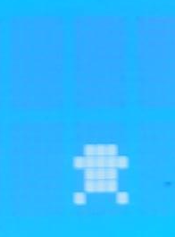
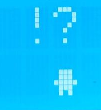

| Supported Targets | ESP32 | ESP32-C2 | ESP32-C3 | ESP32-C6 | ESP32-H2 | ESP32-S2 | ESP32-S3 |
| ----------------- | ----- | -------- | -------- | -------- | -------- | -------- | -------- |

# _JSGOTCHI_

---

Bienvenue dans le futur du FUN !

Ce jeu, basé sur le concept du Tamagotchi, vous rend maître d'un jeune diplômé en informatique dans sa quête de créer de super frameworks !

Motivez le ! Faites le intéragir avec d'autres ! Donnez lui PLUS DE GURU, ENCORE PLUUUUUUUUUUUUS DE GURU !

## Plan de fonctionnement

## GPIO 
| GPIO | MODE   | CIBLE              | OBJECTIF                                                                 | 
|------|--------|--------------------|--------------------------------------------------------------------------|
| 19   | OUTPUT | LED                | Eclairage de la led de fatigue du Gotchi                                 |
| 21   | SDA    | LCD                | Gestion SDA de l'écran                                                   |
| 22   | SCL    | LCD                | Gestion SCL de l'écran                                                   |
| 14   | INPUT  | Capteur infrarouge | Detection de présence infrarouge pour la solitude de proximité du Gotchi |
| 25   | OUTPUT | Buzzer             | Buzzer qui se déclenche lors de la solitude BLE                          |
| 32   | INPUT  | BUTTON             | Donner de l'energie au Gotchi                                            |
| 35   | INPUT  | BUTTON             | Changer l'écran actif                                                    |

## ELEMENTS

| ELEMENT                  | UTILISATION             | REPRESENTATION                                                  | IMPLEMENTATION                                                                                                                                                                               |
|--------------------------|-------------------------|-----------------------------------------------------------------|----------------------------------------------------------------------------------------------------------------------------------------------------------------------------------------------|
| LCD                      | Affichage               |    | Coeur même du jeu, le LCD est séparé en 3 écrans distinct, chacun affichant des caractéristiques. Voir plus sur les section dans la [section dédiée](#ECRANS)                            |
| LED                      | Notification visuelle   |         | La LED servira a notifier le joueur lors d'un niveau d'energie trop faible.  Elle s'éteindra lorsque celui ci remontera                                                                  |
| Capteur de proximité | Interaction humaine     |         | Le capteur de proximité infrarouge viendra exciter le gotchi, qui verra sa productivité augmentée.                                                                                           |
| Bouton 1 : Energie       | Interaction utilisateur |         | Ce bouton permet de fournir de l'energie au Gotchi, afin d'augmenter sa productivité. **Mais attention** ! Trop lui en donner réduira considérablement la qualité des Frameworks dévellopés. |
| Bouton 2 : Ecrans        | Interaction utilisateur |         | Ce bouton permet de changer l'écran actif. Voir la  [section dédiée](#ECRANS)                                                                                                                |
| Sirène                   | Notification sonore     |     | Le buzzer sonnera quand le gotch se sentira seul                                                                                                                                             |
| BLE                      | Interaction Gotchienne  |                                                                 | Le BLE permet la communication entre les gotchis a proximité, afin de faire qu'il se sente moins seul, et ainsi augmente la vitesse et la qualité de production de nouveaux frameworks.      |
| Wifi                     | Heure                   |                                                                 | Le wifi permet d'aller récupérer l'heure réelle du réseau wifi dans lequel il a été configuré.                                                                                               |

## ECRANS
### Ecran 1

### Ecran 2

### Ecran 3

## ETATS DE L'AVATAR
L'avatar possède plusieurs états affectant sa productivité:

| ETAT       | REPRESENTATION                                                                                                                | EFFET                                                                                                   | 
|------------|-------------------------------------------------------------------------------------------------------------------------------|---------------------------------------------------------------------------------------------------------|
| Reposé     |   | L'avatar se sent bien, sa productivité et la qualité sont elevées                                       |
| Fatigué    |      | L'avatar somnole, sa productivté est en baisse                                                          |
| Epuisé     |     | L'avatar dors, sa productivité est au minimum                                                           |
| Hyperactif |   | L'avatar à bu trop de GURU, sa productivité est maximale, mais la qualité des frameworks est affaiblie. |
| Excité     |      | L'avatar est surpris en train de flâner, la qualité du code augment.                                    |
| Solitaire  | Pas de représentation visuelle, mais le buzzer se met a sonner                                                                | La qualité et la vitesse de developpement des frameworks est grandement diminuée                        |
